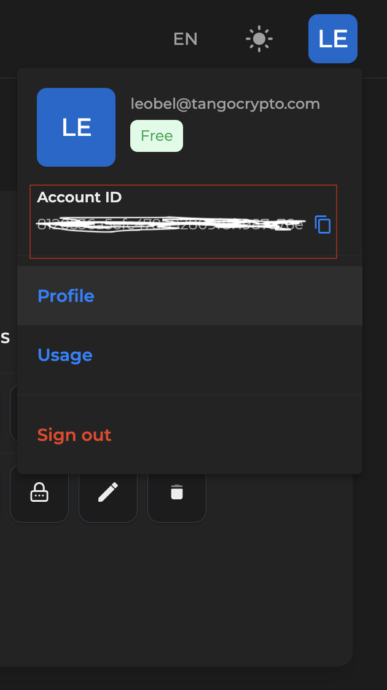
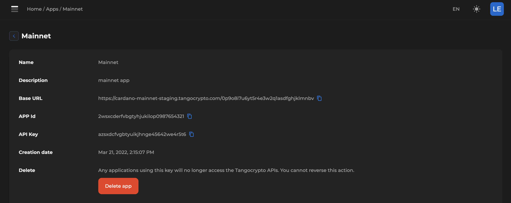

## tangocrypto-js

TypeScript/JavaScript sdk for Tangocrypto platform.

## Getting started
Go to [tangocrypto.com](https://www.tangocrypto.com), login/register, then create an app and save your `apiKey` and `appId`.

### ApiKey
Click on the top right icon in your dashboard and copy the value for **Account ID** .


### AppId
In the dashboard go to your app details and copy the value for **APP Id**.


## Installation

This library is intended to be use on Node.js

```console
npm i @tango-crypto/tangocrypto-js
```

## Initialization

Using the SDK is pretty simple as you can see from the following examples. You just need to create an `Tangocrypto` instance. 


```js
import { Tangocrypto, Network } from '@tango-crypto/tangocrypto-js';
// or CommonJS
// const { Tangocrypto, Network } = require('@tango-crypto/tangocrypto-js');


const client = new Tangocrypto({
    apiKey: process.env.API_KEY, // your account id
    appId: process.env.APP_ID, // your app id
    network: Network.CARDANO_MAINNET, // Network to determine the base URL, default to https://cardano-mainnet.tangocrypto.com
    version: process.env.VERSION, // API version, default to v1
    maxAttempts: 5 // maximmum retry attemps when request fails and is retryable (e.g. status 429) 
})
```

### Settings Options
* `apiKey`: Your account Id (required).
* `appId`: Your app Id (required).
* `network`: Network to determine the base URL, default to `https://cardano-mainnet.tangocrypto.com`
* `version`: String for API version, default to `v1`.
* `maxAttempts`: Number indicating the maximmum retry attemps when request fails and is retryable (e.g. status 429).

For more [examples](https://www.github.com/tango-crypto/tangocrypto-js/examples/) take a look in examples directory.

### Consume API
After you have created a `Tangocrypto` instance you have different API instances to interact with the backend. 

* `Addresses`: Get access to a set of endpoints cardano address related.
* `Assets`: Get access to a set of endpoints cardano asset related.
* `Blocks`: Get access to a set of endpoints cardano block related.
* `Epochs`: Get access to a set of endpoints cardano epoch related.
* `Policies`: Get access to a set of endpoints cardano policy related.
* `Pools`: Get access to a set of endpoints cardano pool related.
* `Transactions`: Get access to a set of endpoints cardano transaction related.
* `Wallets`: Get access to a set of endpoints cardano stake address related.
* `Webhooks`: Get access Webhooks API.
* `Nfts`: Get access to NFT Studio API.

## API Response
All API instances methods return an instance of `TangocryptoResponse<T>` definde this way:
```js
export interface TangocryptoResponse<T> {
    result: T;
    $metadata: Metadata;
}
```
Where `T` corresponding to the data specific for each endpoint. More info about each endpoint request/response [here](https://www.tangocrypto.com/api-reference). The field `$metadata` contains the `attemps` and `totalRetryDelay` were needed in order to perform the request. If the request was success in the first call `$metadata` will look like this:
```js
{ attempts: 1, totalRetryDelay: 0 }
```

## Error Handling
The errors throws by this sdk are instances of `TangocryptoError` with the same structure you get from the API.
```js
{
    "status_code": 404,
    "message": "epoch: 63 not found",
    "error": "Not Found"
}
``` 
Check [here](https://www.tangocrypto.com/api-reference/#/errors) for all possible `status_code` and `error`;

`TancryptoError` extends built-in `Error` class, so you can catch it in your code and perform custom logic.

```js
const api = new Tangocrypto({
    apiKey: process.env.API_KEY,
    appId: process.env.APP_ID,
    network: Network.CARDANO_TESTNET,
    version: process.env.VERSION
}).block()

// missing block number
const block = -1;

try {
    const response = await api.getBlock(block);
} catch (err) {
    if (err instanceof TangocryptoError) {
        // missing block number
        console.log(err.toString()); // TangocryptoError: {"status_code":404,"message":"block number: -1 not found","error":"Not Found"}
    } else {
        // other errors
        throw err;
    }
}
```


## Example

Getting latest block in the blockchain
```js
const api = client.block(); // get block API client instance
const response = await api.getLatestBlock();

console.log(response.result);
Output:
>> {
    "hash": "7135250e403466c2163c6ba3aa8606f4dd6396e282c512486740aeaa220fbaf9",
    "epoch_no": 229,
    "slot_no": 68672434,
    "epoch_slot_no": 114034,
    "block_no": 3832866,
    "previous_block": 3832865,
    "slot_leader": "pool1l8kt8vn966ylkgysaj28ut34qu8z7nrjxyjj3n77v9ae6clyjfp",
    "confirmations": 1,
    "size": 4,
    "time": "2022-09-13T04:00:50.000Z",
    "tx_count": 0,
    "vrf_key": "vrf_vk1cxcf73rmj7luakn0ykjtvsf3mzqj5akhh3j82hamch4srlvx37tsy2gg35",
    "op_cert": "48a680a489fbf4d0035afec3596e42eb05c2d2d3ebfa4ca5f6210ddb74d7facc"
}
```

Please check our [docs](https://docs.tangocrypto.com/) for more information about all the tangocrypto features.


